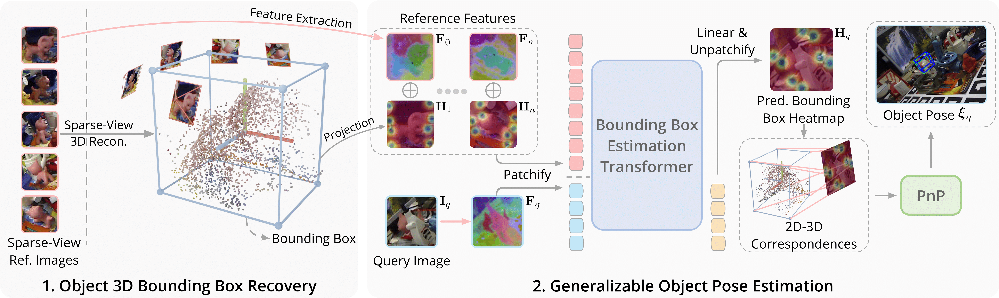

<div align="center">
  <h1>🛸 BoxDreamer: Dreaming Box Corners for Generalizable Object Pose Estimation</h1>
</div>

<div align="center">
  <a href="https://yuanhongyu.xyz/">Yuanhong Yu</a> &bull;
  <a href="https://github.com/hxy-123">Xingyi He</a> &bull;
  <a href="https://sailor-z.github.io/">Chen Zhao</a> &bull;
  <a href="https://openreview.net/profile?id=~Junhao_Yu3">Junhao Yu</a> &bull;
  <a href="https://yangjiaqihomepage.github.io/">Jiaqi Yang</a> &bull;
  <a href="https://csse.szu.edu.cn/staff/ruizhenhu/">Ruizhen Hu</a> &bull;
  <a href="https://shenyujun.github.io/">Yujun Shen</a> &bull;
  <a href="https://openreview.net/profile?id=~Xing_Zhu2">Xing Zhu</a> &bull;
  <a href="https://www.xzhou.me/">Xiaowei Zhou</a> &bull;
  <a href="https://pengsida.net/">Sida Peng</a>
</div>

<div align="center">

### [Project Page](https://zju3dv.github.io/boxdreamer) | [Paper](https://arxiv.org/pdf/2504.07955) | [🤗 Demo](https://huggingface.co/spaces/LittleFrog/BoxDreamer)

### ICCV 2025
</div>

<div align="center">

[](https://www.python.org/)
[](https://pytorch.org/)
[](https://www.pytorchlightning.ai/)
[](https://hydra.cc/)
[](https://black.readthedocs.io/en/stable/)
[](https://github.com/pre-commit/pre-commit)
<!--  -->
[](https://huggingface.co/yyh929/BoxDreamer)
[](https://huggingface.co/spaces/LittleFrog/BoxDreamer)

</div>

> 📦✨ Dream up accurate 3D bounding boxes for objects in the wild!

## 📋 Table of Contents

- [📋 Table of Contents](#-table-of-contents)
- [📦 Method Overview](#-method-overview)
- [📅 Release Roadmap](#-release-roadmap)
- [📋 Reconstuction methods support list](#-reconstuction-methods-support-list)
- [💻 Installation](#-installation)
- [🤝 Third-party Dependencies](#-third-party-dependencies)
  - [Add submodules](#add-submodules)
  - [Make vscode python env work correctly (Optional)](#make-vscode-python-env-work-correctly-optional)
- [🔗 Download ckpts for reconstruction](#-download-ckpts-for-reconstruction)
- [🤗 Gradio demo](#-gradio-demo)
- [📂 Dataset Preparation](#-dataset-preparation)
  - [LINEMOD](#linemod)
  - [OnePose \& OnePose-LowTexture](#onepose--onepose-lowtexture)
  - [Occluded LINEMOD](#occluded-linemod)
  - [YCB-Video](#ycb-video)
  - [Preprocess](#preprocess)
    - [YCB-Video FoundationPose Reference (Optional)](#ycb-video-foundationpose-reference-optional)
    - [YCB-Video Preprocess](#ycb-video-preprocess)
    - [Occluded LINEMOD Preprocess](#occluded-linemod-preprocess)
- [Reference Database Creation (Optional)](#reference-database-creation-optional)
- [🚀 Reconstruction](#-reconstruction)
- [🏋️ Training](#️-training)
- [📊 Evaluation](#-evaluation)
- [📦 Model Zoo](#-model-zoo)
- [❓ Frequently Asked Questions](#-frequently-asked-questions)
- [📝 Citation](#-citation)
- [📄 License](#-license)
- [🙏 Acknowledgements](#-acknowledgements)

## 📦 Method Overview

<p align="center">
  
</p>

## 📅 Release Roadmap

| Feature                                                          | Status         | Due Date       |
| ---------------------------------------------------------------- | -------------- | -------------- |
| Core model implementation                                        | ✅ Complete    | March 13, 2025 |
| Pretrained model weights                                         | ✅ Complete    | March 20, 2025 |
| Detailed training & fine-tuning instructions (on custom dataset) | ⏳ In Progress | TBD            |
| Support more reconstruction methods                              | Planning       | TBD            |

## 📋 Reconstuction methods support list

- [x] DUSt3R
- [x] Colmap
- \[\] VGGSFM
- \[\] VGGT
- \[\] MASt3R
- \[\] Fast3R

## 💻 Installation

Follow the steps below to set up your environment for BoxDreamer. For faster dependency installation, we recommend using [uv](https://docs.astral.sh/uv/#highlights).

```bash
# Create a conda environment
conda create -n boxdreamer python=3.11
conda activate boxdreamer

# Install PyTorch (adjust for your CUDA version)
pip install torch==2.5.1 torchvision==0.20.1 torchaudio==2.5.1 --index-url https://download.pytorch.org/whl/cu121

# Install Pytorch3d
pip install "git+https://github.com/facebookresearch/pytorch3d.git"

# Install dependencies
pip install -r requirements.txt

# (Optional) Install SAM2 for real-world demo (CUDA 12.1 + python 3.11 + pytorch 2.5.1)
# Find suitable whl from https://miropsota.github.io/torch_packages_builder/sam-2/
pip install https://github.com/MiroPsota/torch_packages_builder/releases/download/SAM_2-1.0%2Bc2ec8e1/SAM_2-1.0%2Bc2ec8e1pt2.5.1cu121-cp311-cp311-linux_x86_64.whl

pip install decord pyqt5 gradio transformers

```

Optional: Use uv for Faster Dependency Installation

```bash
# install uv
curl -LsSf https://astral.sh/uv/install.sh | sh
```

and running pip command with uv like:

```bash
uv pip install -r requirements.txt
```

## 🤝 Third-party Dependencies

### Add submodules

<!-- git submodule add git@github.com:naver/mast3r.git ./three/mast3r
git submodule add https://github.com/naver/dust3r.git ./three/dust3r
git submodule add git@github.com:facebookresearch/vggsfm.git ./three/vggsfm -->

```bash
git submodule update --init --recursive
```

### Make vscode python env work correctly (Optional)

```bash
touch .env
echo "PYTHONPATH=three/dust3r" >> .env
```

## 🔗 Download ckpts for reconstruction

```bash
mkdir weights && cd weights
wget https://download.europe.naverlabs.com/ComputerVision/DUSt3R/DUSt3R_ViTLarge_BaseDecoder_512_dpt.pth
```

## 🤗 Gradio demo

```bash
python -m src.demo.gradio_demo --ckpt path_to_boxdreamer_ckpt

# Or, load ckpt from huggingface

python -m src.demo.gradio_demo --hf
```

## 📂 Dataset Preparation

### LINEMOD

You can download the dataset from [CDPN](https://github.com/LZGMatrix/CDPN_ICCV2019_ZhigangLi). Then extract the dataset to `data/lm` folder.

### OnePose & OnePose-LowTexture

Download OnePose dataset from OpenDataLab [OnePose](https://opendatalab.com/OpenDataLab/OnePose), OnePose-LowTexture from [here](https://zjueducn-my.sharepoint.com/personal/12121064_zju_edu_cn/_layouts/15/onedrive.aspx?id=%2Fpersonal%2F12121064%5Fzju%5Fedu%5Fcn%2FDocuments%2FOnePose%5FLowTexture&ga=1). Then extract the dataset to `data/onepose` folder and `data/onepose_lowtexture` separately.

### Occluded LINEMOD

Download the dataset from [here](https://bop.felk.cvut.cz/datasets/). Then extract the dataset to `data/lmo` folder.

### YCB-Video

Download the dataset from OpenDataLab [YCB-Video](https://opendatalab.com/OpenDataLab/YCB-Video). Then extract the dataset and move the `YCB_Video_Dataset` folder to `data/ycbv` folder.
You can get foundationpose reference database from [here](https://drive.google.com/drive/folders/1PXXCOJqHXwQTbwPwPbGDN9_vLVe0XpFS).

### Preprocess

#### YCB-Video FoundationPose Reference (Optional)

```bash
python src/datasets/utils/ycbv/foundationpose_ref_process.py.py
```

#### YCB-Video Preprocess

```bash
python src/datasets/utils/ycbv/ycbv_preprocess.py
```

#### Occluded LINEMOD Preprocess

```bash
python src/datasets/utils/linemod_utils/linemod_o_process.py
```

## Reference Database Creation (Optional)

```bash
# Create FPS 5 views database for LINEMOD
python -m src.datasets.utils.view_sampler --dataset linemod --method fps --num_views 5 --root data/lm
```

## 🚀 Reconstruction

```bash
# Basic usage: Reconstruct LINEMOD with DUSt3R
python -m src.reconstruction.main --dataset LINEMOD --reconstructor dust3r --ref_suffix _fps_5
```

**Key Parameters:**

- --dataset: Dataset name (LINEMOD, OnePose, etc.)
- --reconstructor: Reconstruction method (dust3r, etc.)
- --ref_suffix: Suffix for reference views database

## 🏋️ Training

```bash
# Basic usage: Train on OnePose with 5 reference views
python run.py --config-name=train.yaml \
    datamodule.train_datasets=[OnePose] \
    datamodule.val_datasets=[OnePose] \
    length=6
```

**Note:** For zsh shell, escape brackets with backslash: \\\[OnePose\\\]

**Key Parameters:**

- datamodule.train_datasets: List of training datasets
- datamodule.val_datasets: List of validation datasets
- length: Number of reference views + 1 query view (e.g., 6 means 5 reference views)

## 📊 Evaluation

```bash
# Basic usage: Evaluate on LINEMOD using FPS 5 views
python run.py --config-name=test.yaml \
    pretrain_name=subfolder \
    exp_name=lm \
    datamodule.test_datasets=[LINEMOD] \
    datamodule.LINEMOD.config.model_suffix=_dust3r_5 \
    datamodule.LINEMOD.config.reference_suffix=_fps_5 \
    length=6

# Or, load ckpt from huggingface (lastest checkpoint)

python run.py --hf --config-name=test.yaml \
    exp_name=lm \
    datamodule.test_datasets=[LINEMOD] \
    datamodule.LINEMOD.config.model_suffix=_dust3r_5 \
    datamodule.LINEMOD.config.reference_suffix=_fps_5 \
    length=6

# Use the reproducible version checkpoint

python run.py --hf --reproducibility --config-name=test.yaml \
    exp_name=lm \
    datamodule.test_datasets=[LINEMOD] \
    datamodule.LINEMOD.config.model_suffix=_dust3r_5 \
    datamodule.LINEMOD.config.reference_suffix=_fps_5 \
    length=6

```

**Key Parameters:**

- pretrain_name: Name of the pretrained model folder
- datamodule.test_datasets: List of test datasets
- datamodule.LINEMOD.config.model_suffix: Suffix for model files
  If not provided, ground truth models will be used for bounding box extraction
- datamodule.LINEMOD.config.reference_suffix: Suffix for reference database
  If not provided, full views database will be used
- length: Number of reference views + 1 query view


For evaluation with a dense reference database, set length to the total number of reference images plus one. Enabling the DINO feature filter (model.modules.dense_cfg.enable=True) will further assist in selecting the most relevant neighbor views for the decoder input.

## 📦 Model Zoo

| Version      | Training Data       | Params | Download                                                                |
| ------------ | ------------------- | ------ | ----------------------------------------------------------------------- |
| Latest | Objaverse + OnePose | 88.6M  | [Download](https://1drv.ms/u/s!Ap2hsgjizYNElLIwfl1m9d3V1yf_OA?e=9sixmD) |
| Pretrained | Objaverse | 88.6M  | Coming soon |

download the ckpt and put it in `models/checkpoints/subfolder` folder and rename it to `last.ckpt`

## ❓ Frequently Asked Questions

<details>
<summary><b>Does BoxDreamer require CAD models or mesh representations of objects?</b></summary>
<p>
No, BoxDreamer does not require any 3D CAD models or mesh representations of objects during inference. This is a key advantage of our approach, as it enables generalization to novel objects without access to their 3D models. During training, we do use bounding box annotations, but no detailed 3D models are required.
</p>
</details>

<details>
<summary><b>How computationally expensive is BoxDreamer during inference?</b></summary>
<p>
The BoxDreamer-Base model runs at over 40 FPS on a single NVIDIA RTX 4090 GPU with 5 reference images.
</p>
</details>

<details>
<summary><b>Can BoxDreamer work with RGB-D images?</b></summary>
<p>
Yes! While the base version of BoxDreamer works with RGB images only, depth information also provides the access to object coordinates in real world. We plan to introduce a variant of BoxDreamer that incorporates depth information in the future.
</p>
</details>

## 📝 Citation

If you find BoxDreamer useful in your research, please consider citing our paper:

```
@article{yu2025boxdreamer,
  title={BoxDreamer: Dreaming Box Corners for Generalizable Object Pose Estimation},
  author={Yu, Yuanhong and He, Xingyi and Zhao, Chen and Yu, Junhao and Yang, Jiaqi and Hu, Ruizhen and Shen, Yujun and Zhu, Xing and Zhou, Xiaowei and Peng, Sida},
  journal={arXiv preprint arXiv:2504.07955},
  year={2025}
}
```

## 📄 License

This project is licensed under the Apache License 2.0 - see the [LICENSE](LICENSE) file for details.

## 🙏 Acknowledgements

Our implementation is based on several open-source repositories.
We thank the authors of these repositories for making their code available.

- [VGGSFM](https://github.com/facebookresearch/vggsfm)
- [DUSt3R](https://github.com/naver/dust3r)
- [OnePose](https://github.com/zju3dv/OnePose) and [OnePose++](https://github.com/zju3dv/OnePose_Plus_Plus)
- [Camera as Rays](http://github.com/jasonyzhang/RayDiffusion)

At the same time, I would like to thank [Yating Wang](https://scholar.google.com.hk/citations?user=5SuBWh0AAAAJ&hl=zh-CN), [Chengrui Dong](https://scholar.google.com/citations?user=rWSguOUAAAAJ&hl=zh-CN), and Yiguo Fan for their sincere suggestions and the valuable live demonstrations they provided.
